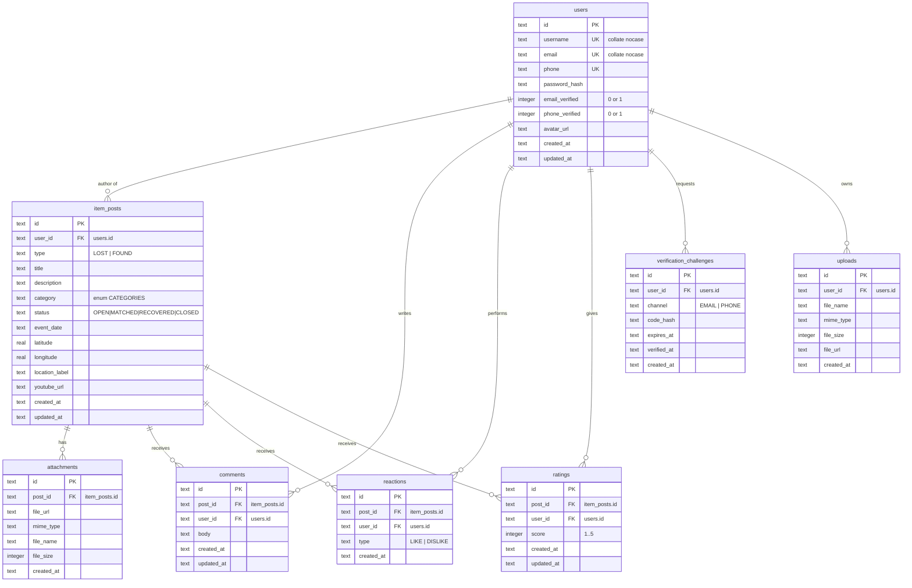

# FindBack — Database Schema & Entity Relationship Diagram

Source of truth: `supabase/migrations/20260912000000_init.sql` (production:
Supabase PostgreSQL). The local/test mirror is
`services/api/src/db/sqliteAdapter.ts` (SQLite `node:sqlite`, WAL mode, foreign
keys enforced). All timestamps are ISO-8601 UTC strings.

## ERD (Mermaid)

## Table reference

| Table | Purpose | Uniqueness / rules |
| --- | --- | --- |
| `users` | App accounts (also the demo "reporters/finders") | username, email, phone unique case-insensitive |
| `item_posts` | Lost/found reports | type in (LOST, FOUND); status defaults OPEN; one author per post |
| `attachments` | Image files linked to a post | optional, many per post |
| `comments` | Discussion under a post | one author per comment |
| `reactions` | One like/dislike vote per (post, user) | UNIQUE(post_id, user_id) |
| `ratings` | One 1–5 star rating per (post, user) | UNIQUE(post_id, user_id), score 1..5 |
| `verification_challenges` | Email/phone OTP challenges | hashed code, expiry timestamp |
| `uploads` | Files uploaded but not yet attached to a post | owned by user |

## Business rules enforced

- A reaction or rating is upserted per unique `(post_id, user_id)` — last write wins.
- `reactions`/`ratings` aggregates on posts are derived by `COUNT`, so they never drift.
- Deleting a post cascades to its attachments/comments/reactions/ratings.
- `verification_challenges` records keep an audit trail; successful verification also flips
  `users.email_verified` / `users.phone_verified`.

## Indexes

| Index | Columns | Purpose |
| --- | --- | --- |
| `idx_posts_type_created` | type, created_at DESC | feed ordering & type filter |
| `idx_posts_category` | category | category filter + reports |
| `idx_posts_user` | user_id | "my posts" |
| `idx_comments_post` | post_id, created_at | comment listing |
| `idx_challenges_user_channel` | user_id, channel | OTP lookups |
